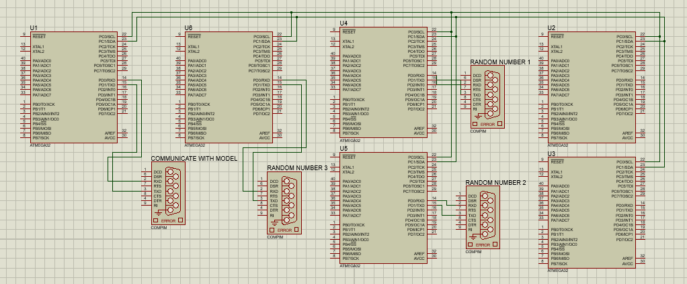
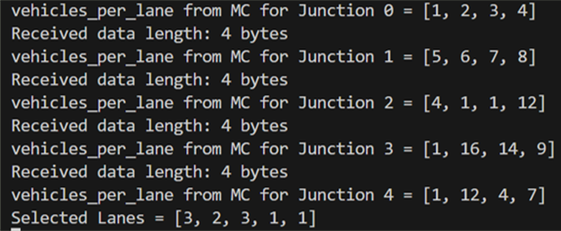
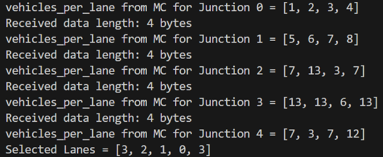

# Adaptive Traffic Light Control Embedded System

## Overview
This project implements an adaptive traffic light control system using an embedded solution. The system utilizes an I2C network with multiple slaves representing junctions and a single master to coordinate traffic flow. Each slave node collects data on the number of cars at its respective junction and communicates this information to the master node. The master node then sends this data to a reinforcement machine learning model via UART for decision-making on traffic light timings. Additionally, the master node sends random states to three slaves via UART for simulation purposes.

## System Architecture
The system architecture consists of the following components:
- Embedded microcontroller boards for master and slave nodes
- I2C communication protocol for interconnecting the nodes
- UART communication for linking the master node with the reinforcement machine learning model and sending random states to three slaves
- Reinforcement machine learning model for adaptive traffic light control

## Simulation Image (Proteus)
*Insert simulation image here*

## Model Actions
The reinforcement machine learning model takes input from the microcontrollers and generates actions based on the states received. The following images illustrate the actions taken by the model:

### Definition:
   - State: The number of cars at each of the four ways in the junction.
   - Action: Determine the sequence and timing of traffic light changes based on traffic flow.

1. Actions 1
   *Insert image of action 1 here*

   

2. Actions 2
   *Insert image of action 2 here*

   

   
## How to Run the Project
To run the project, follow these steps:

1. **Generate Random Numbers for Microcontrollers**:
   - Run the Python script `Micro controller code\Random_numbers_form_Python_to_MC\SEND_data_slave1.py` to generate random numbers for the first slave microcontroller.
   - Repeat this step for the other two slave microcontrollers, using the appropriate Python scripts.

2. **Run Reinforcement Learning Model**:
   - Run the `train.py` script to train the reinforcement learning model.

3. **Run Proteus Simulation**:
   - Open the Proteus simulation file located at `Micro controller code\simulation\Simulation.pdsprj`.
   - The hex and elf files are already plugged into the microcontrollers in the simulation.

4. **Start VSPE**:
   - Open VSPE and create virtual serial ports for communication between the master node and the reinforcement machine learning model.

5. **Run the Simulation**:
   - Start the simulation in Proteus.

6. **Monitor Output**:
   - Monitor the output in the virtual terminal to observe the communication between the master node and the reinforcement machine learning model.
