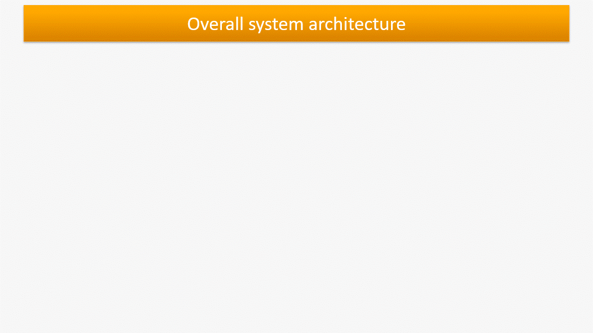
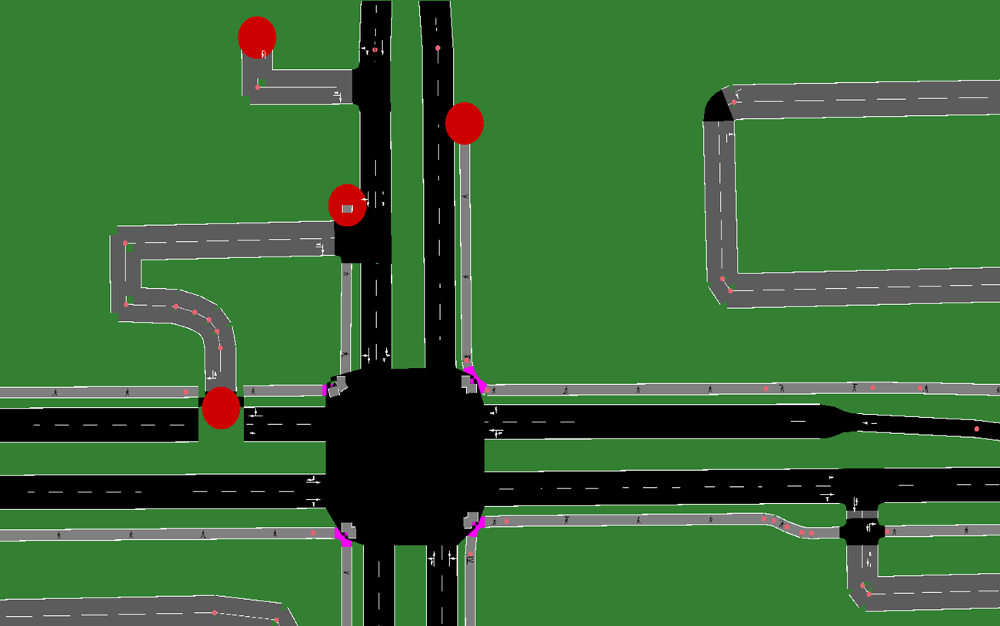

# Advanced Adaptive Traffic Light Control System

This repository contains the Advanced Adaptive Traffic Light Control System, which uses machine learning and microcontroller technologies to manage traffic lights more efficiently and adaptively. This system is designed to handle complex traffic scenarios, dynamically adjusting the duration of each traffic light phase based on real-time conditions.

## Overview

The system leverages machine learning models and ESP microcontrollers to manage traffic lights at intersections. The key features of this version include handling complex maps with multiple lanes and dynamically calculating the duration of each traffic light phase based on the current traffic situation. The communication network is enhanced with Bluetooth, ensuring robust and flexible connectivity.

### GIF Demonstration



## Complex Junction Example

The new version of the model is capable of handling complex junctions with intricate lane structures. Below is an example of such a complex junction that the system can manage:



## Key Features

1. **Complex Map Handling**: The model can manage junctions with multiple lanes, making it suitable for more intricate traffic networks.
2. **Dynamic Phase Duration**: The system calculates the duration of each traffic light phase based on the number of cars, providing an adaptive response to real-time traffic conditions.
3. **Bluetooth Integration**: The communication network now includes Bluetooth for enhanced connectivity between components.

## System Components

- **ESP Microcontrollers**: Manage the traffic lights and communicate with the central control system.
- **Machine Learning Model**: Analyzes real-time traffic data and determines the optimal traffic light durations.
- **Communication Network**: Utilizes Bluetooth for robust and flexible connectivity between microcontrollers and the central system.

## Installation and Setup

### Prerequisites

- SUMO (Simulation of Urban MObility) for traffic simulation.
- Python 3.8 and necessary libraries (see `requirements.txt` for dependencies).
- ESP microcontrollers with Bluetooth capabilities.
- Appropriate hardware setup for the communication network.

### Installation

1. **Clone the Repository**:
   ```bash
   git clone https://github.com/AhmedMohamedomar74/adaptive-traffic-light-control-system.git
   cd adaptive-traffic-light-control-system/V2
2. **Install Dependencies**:
   ```bash
   pip install -r requirements.txt

3. **SUMO GUI**:
   Download and install the SUMO GUI from [the official website](https://sumo.dlr.de/docs/Downloads.php) if you 
   haven't already.

### Hardware Setup
1. **Microcontroller Configuration**:
    Configure the ESP microcontrollers with the provided code. Ensure the Bluetooth
2. **Network Configuration**:
    Set up the communication network between microcontrollers and the central system using Bluetooth
### Running the System
1. **Power on the Microcontrollers**:
    Ensure all microcontrollers are properly connected and powered on.
2. **Run the Control Script**:
    Set up the communication network between microcontrollers and the central system using Bluetooth
    ```bash
    python train.py
3. **Running the Advanced Model**:
    To run the advanced model, use the following command:
    ```bash
    python train_adv.py
    
Additionally, you need to modify the configuration file:
- Replace `city1` with `osm` in the configuration file to match the advanced model's requirements.


